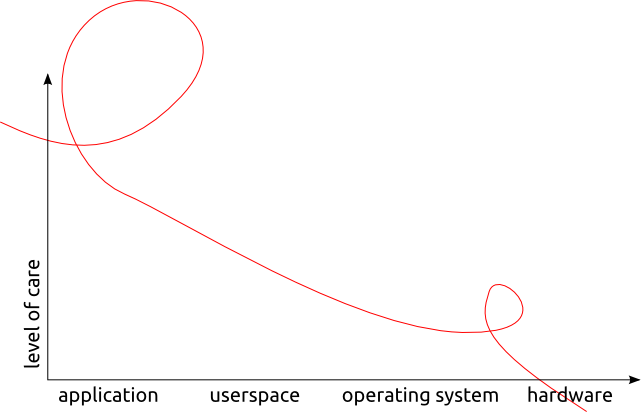
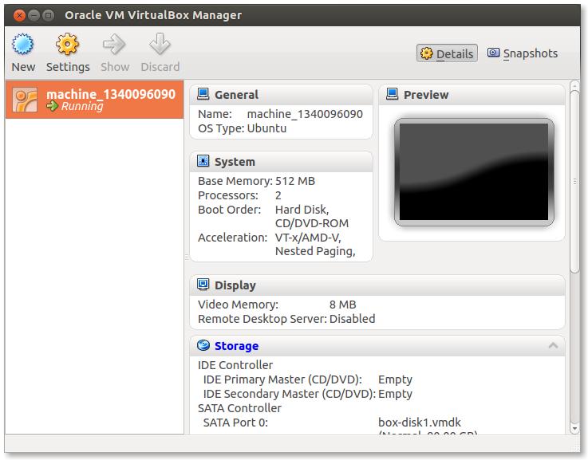

!SLIDE 
## Kochen mit Vagrant & Puppet ##
### Cologne.rb · 20.06.2012 ###

Sebastian Schulze · @bascht · github.com/bascht

!SLIDE subsection
# Vagrant #

!SLIDE 
## Tool zur Verwaltung und Beschreibung von virtuellen Maschinen. ##

!SLIDE center

> »Geschnittenes Brot«.

!SLIDE smbullets incremental
# Über mich

* Freiberuflicher DevOp
* In-House Sisyphos
* Zwischen Development, Testing & Deployment

!SLIDE center

!SLIDE incremental smaller
# Keine Lust…

* …sich mit Formatierung herumzuschlagen: **Markdown**
* …Pakte von Hand zu installieren: **Bundler**
* …virtuelle Maschinen zu pflegen: **Vagrant**
* …Serverkonfigurationen von Hand zu pflegen: **Puppet**

!SLIDE 
# Infrastructure as Code

!SLIDE code smaller

    @@@ ruby
    Vagrant::Config.run do |config|
      config.vm.name    = "colognerb"
      config.vm.box     = "base"
      config.vm.box_url = "http://files.vagrantup.com/lucid32.box"

      config.vm.customize ["modifyvm", :id, "--memory", "512"]
      config.vm.customize ["modifyvm", :id, "--cpus", "2"]

      config.vm.network :hostonly, "33.33.33.42"
    end

!SLIDE center

!SLIDE commandline incremental
# DSL für VBoxManage

    $ cat .vagrant
    {"active":{"default":"d7ab1994-ed44-4857-88bc-eb6c51dec09a"}}

    $ vboxmanage list runningvms
    "machine_1340096090" {d7ab1994-ed44-4857-88bc-eb6c51dec09a}

!SLIDE incremental center
## Lifecycle-Management
(Bingo!)

* `1 UP`
* `2 SUSPEND`
* `3 HALT`
* `4 DESTROY`
* `6 GOTO 1`

!SLIDE incremental commandline center
## OS X Goodness

    $ gem install vagrant-dns

!SLIDE center
# ✔ Hardware

!SLIDE subsection 
# Puppet

!SLIDE 
# CMS

!SLIDE incremental
## Configuration Management Software

* …wie Chef.
* …oder CFEngine.
* …oder Perl.

!SLIDE center
> Woanders ist auch scheiße.

!SLIDE incremental
# Puppet

## Nodes
## Manifests
### Klassen
### Defines
## Templates
## Files

!SLIDE code smaller center
# (Fast) OS-Agnostisch.

!SLIDE code smaller center
# (Fast) lesbar.

    package { "vim": ensure => latest }
    package { "emacs": ensure => absent }

    node "cologne.onruby" { }

!SLIDE
## Demo-Time.

